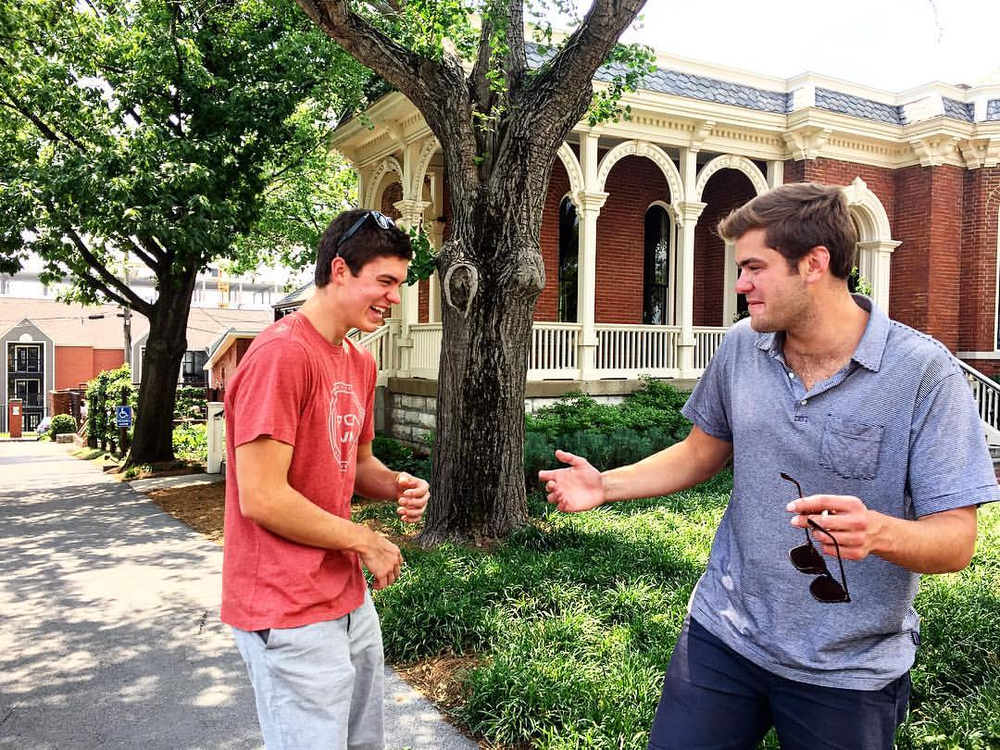
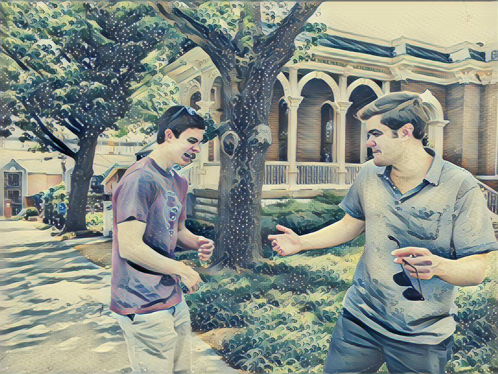

## Evaluating Fast Style Transfer

After watching Gene Kogan's PyData London 2017 [talk](https://youtu.be/JXx2MYtAU3o) I thought I'd try out some of these style transfer networks. 
Searching around a bit, I found Gene's [fast-style-transfer](https://github.com/genekogan/fast-style-transfer) Github page which provides really easy setup and run instructions. I got this running with minimal effort and thought I'd post the results here. 

These are what the final images looked like:

#### Input Image
<p align = 'center'>

</p>

#### Stylized as "Rain Princess"
<p align = 'center'>

</p>

#### Stylized as "Wave"
<p align = 'center'>

<!-- <a href = 'examples/results/stata_udnie.jpg'></a> -->
</p>

### Step-by-step instructions

- Make sure you have tensorflow installed: `pip install tensorflow`
- Running the code initially may give an error that it can't find `scipy.misc.imread()`. That comes from scipy explicitly [not wanting to install PIL](http://stackoverflow.com/questions/15345790/scipy-misc-module-has-no-attribute-imread) (now Pillow). Run `pip install pillow` and then you should have all dependencies installed. 
- Download some trained networks from [here](https://drive.google.com/drive/folders/0B9jhaT37ydSyRk9UX0wwX3BpMzQ). These networks have been trained on the images located in `examples/style` - I only kept `rain_princess` and `wave` to evaluate my pictures on. 
- I then ran
```sh
python evaluate.py --checkpoint PATH/TO/MODELS/rain_princess.ckpt --in-path examples/content/joshtest1.jpg --out-path examples/results/joshtest1_rain_princess.jpg
```
to give me the rain_princess stylized image. The models evaluate quite quickly. 


